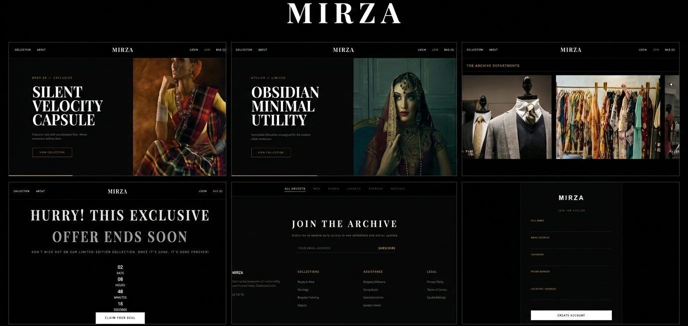

<div align="center">

  
  
  

  <br />

  <h1 align="center">MIRZA Clothing Brand</h1>
  <p align="center">
    <strong>An Enterprise-Grade Full-Stack E-Commerce Ecosystem</strong><br />
    <em>Bridging the gap between luxury retail and high-performance cloud architecture.</em>
  </p>

  <a href="https://mirza-brand-1.onrender.com/">
    
  </a>

</div>

<br />

---

### 🚀 The Digital Transformation
Originally conceived as a local legacy application, **MIRZA Clothing Brand** underwent a complete digital transformation. I migrated the entire infrastructure from a local Oracle environment to a **containerized cloud architecture** on Render. 

This project is a deep dive into **Relational Data Modeling** and **Asynchronous API management**.

### 🛠️ The Architecture


* **The Brain (Backend):** A robust Java Spring Boot engine handling secure business logic and RESTful routing.
* **The Face (Frontend):** A high-performance React-driven UI, optimized for rapid rendering and mobile responsiveness.
* **The Vault (Database):** A managed PostgreSQL instance hosted on Render, featuring 113+ relational product schemas.

### 🌟 Unique Engineering Milestones
* **Zero-Hardcode Connectivity:** Implemented a secure **Environment Variable** injection system for database credentials, following industry security standards.
* **Cloud Schema Migration:** Successfully solved the "PostgreSQL Case-Sensitivity" challenge by standardizing table naming conventions for cross-platform compatibility.
* **State-Persistent Inventory:** Engineered an Admin Module capable of tracking real-time stock levels and order metrics across 5 main product categories.

---

### 📦 Tech Stack & Tools
| Frontend | Backend | Database & Cloud |
| :--- | :--- | :--- |
| React.js | Java 17 | PostgreSQL (Render) |
| HTML5 / CSS3 | Spring Boot | Hibernate / JPA |
| JavaScript (ES6+) | Tomcat | DBeaver |

---

### 📋 Project Overview
**MIRZA Clothing Brand** is a full-stack e-commerce ecosystem designed to provide a premium shopping experience while utilizing modern cloud-native architecture. Featuring a dynamic catalog of over 110 products, the platform leverages a **PostgreSQL** database to manage secure user authentication, role-based access control, and real-time inventory tracking. 

Key highlights include a successful migration from local Oracle environments to the cloud, optimization of **JDBC connectivity**, and the implementation of secure environment-variable management.

### ✨ Core Features
* **Dynamic Catalog:** 113+ products including Luxury Watches, Eyewear, and Jackets.
* **Secure Auth:** Integrated Login/Registration system for Users and Admins.
* **Admin Dashboard:** Real-time stock management and order count tracking.
* **Responsive Design:** Fully mobile-friendly UI for a seamless shopping experience.

---

### ⚙️ Prerequisites
Before you begin, ensure you have met the following requirements:
* [Java JDK 17+](https://www.oracle.com/java/technologies/downloads/)
* [Maven](https://maven.apache.org/download.cgi)
* [Git](https://git-scm.com/downloads) installed on your OS.

### 🏁 Quick Start
1. **Clone the Repository:**
   ```bash
   git clone [https://github.com/ahmedbaiginam-stack/Mirza-Brand/](https://github.com/ahmedbaiginam-stack/Mirza-Brand/)
   cd Mirza-Brand
